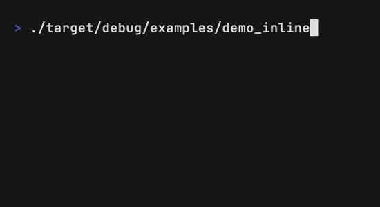
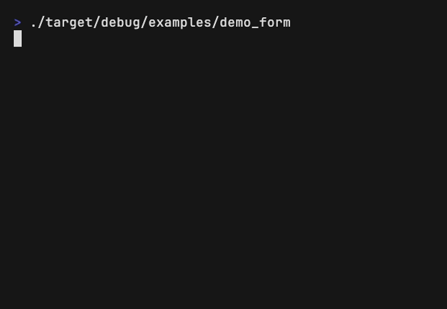

# Blaeck

A terminal UI framework for Rust. Inline rendering, flexbox/grid layout, 35+ components.

[](https://crates.io/crates/blaeck)
[](https://docs.rs/blaeck)
[](LICENSE)


## Install

```toml
[dependencies]
blaeck = "0.2"
```

---

## Inline Rendering

The killer feature: blaeck renders **within your terminal flow**. Output stays in scrollback. `println!()` works before and after.



```rust
use blaeck::prelude::*;
use std::{thread, time::Duration};

fn main() -> std::io::Result<()> {
    println!("Starting build...\n");

    let mut blaeck = Blaeck::new(std::io::stdout())?;

    for i in 0..=10 {
        let bar = "█".repeat(i * 2) + &"░".repeat(20 - i * 2);
        blaeck.render(element! {
            Box(border_style: BorderStyle::Round, padding: 1.0) {
                Text(content: "Building...", bold: true)
                Text(content: bar, color: Color::Green)
            }
        })?;
        thread::sleep(Duration::from_millis(200));
    }

    blaeck.unmount()?;
    println!("Done! Terminal keeps working.");
    Ok(())
}
```

---

## Interactive Apps

Use `ReactiveApp` for keyboard-driven UIs. State changes trigger automatic re-renders.



```rust
use blaeck::prelude::*;
use blaeck::reactive::*;
use crossterm::event::KeyCode;

fn form(cx: Scope) -> Element {
    let name = use_state(cx.clone(), || String::new());
    let env = use_state(cx.clone(), || 0usize); // 0=dev, 1=staging, 2=prod
    let confirmed = use_state(cx.clone(), || false);
    let focus = use_state(cx.clone(), || 0usize); // 0=name, 1=env, 2=confirm

    let envs = vec!["Development", "Staging", "Production"];

    let name_h = name.clone();
    let env_h = env.clone();
    let confirmed_h = confirmed.clone();
    let focus_h = focus.clone();

    use_input(cx, move |key| {
        let f = focus_h.get();
        match key.code {
            KeyCode::Tab => focus_h.set((f + 1) % 3),
            KeyCode::BackTab => focus_h.set(if f == 0 { 2 } else { f - 1 }),
            KeyCode::Up if f == 1 => env_h.set(if env_h.get() == 0 { 2 } else { env_h.get() - 1 }),
            KeyCode::Down if f == 1 => env_h.set((env_h.get() + 1) % 3),
            KeyCode::Char(' ') if f == 2 => confirmed_h.set(!confirmed_h.get()),
            KeyCode::Char(c) if f == 0 => {
                let mut s = name_h.get();
                s.push(c);
                name_h.set(s);
            }
            KeyCode::Backspace if f == 0 => {
                let mut s = name_h.get();
                s.pop();
                name_h.set(s);
            }
            _ => {}
        }
    });

    let f = focus.get();
    let name_val = name.get();
    let env_val = env.get();
    let conf_val = confirmed.get();

    element! {
        Box(flex_direction: FlexDirection::Column, border_style: BorderStyle::Round, padding: 1.0) {
            Text(content: "Deploy Configuration", bold: true, color: Color::Cyan)
            Newline

            // Name field
            Text(content: "Project name:", bold: f == 0)
            Box(flex_direction: FlexDirection::Row) {
                Text(content: if f == 0 { "> " } else { "  " }, color: Color::Green)
                Text(
                    content: if name_val.is_empty() { "(type here)".to_string() } else { name_val },
                    color: if f == 0 { Color::White } else { Color::DarkGray }
                )
                Text(content: if f == 0 { "_" } else { "" }, color: Color::Green)
            }
            Newline

            // Environment selector
            Text(content: "Environment:", bold: f == 1)
            #(Element::column(
                envs.iter().enumerate().map(|(i, e)| {
                    let selected = i == env_val;
                    let focused = f == 1;
                    let prefix = if selected { "● " } else { "○ " };
                    element! {
                        Text(
                            content: format!("  {}{}", prefix, e),
                            color: if selected && focused { Color::Green } else { Color::White },
                            bold: selected
                        )
                    }
                }).collect()
            ))
            Newline

            // Confirm checkbox
            Box(flex_direction: FlexDirection::Row) {
                Text(content: if f == 2 { "> " } else { "  " }, color: Color::Green)
                Text(
                    content: format!("[{}] I confirm this deployment", if conf_val { "x" } else { " " }),
                    bold: f == 2
                )
            }
            Newline

            Text(content: "Tab: next field | Space: toggle | Ctrl+C: exit", dim: true)
        }
    }
}

fn main() -> std::io::Result<()> {
    ReactiveApp::run(form)?;
    Ok(())
}
```

**Key concepts:** `use_state` creates reactive state. `use_input` registers keyboard handlers. When state changes, UI re-renders automatically.

---

## When to Use Blaeck

**Good for:**
- CLI tools with rich output (installers, build tools)
- Interactive prompts with layout control
- Progress displays, dashboards
- Any UI that shouldn't take over the screen

**Not for:**
- Fullscreen TUIs → use [Ratatui](https://github.com/ratatui-org/ratatui)
- Simple prompts → use [inquire](https://github.com/mikaelmello/inquire)

---

## Components

| Category | Components |
|----------|------------|
| **Layout** | `Box`, `Spacer`, `Newline`, `Indent` |
| **Text** | `Text`, `Gradient`, `Markdown`, `SyntaxHighlight` |
| **Input** | `TextInput`, `Select`, `MultiSelect`, `Checkbox`, `Confirm` |
| **Data** | `Table`, `Tabs`, `TreeView`, `BarChart`, `Sparkline` |
| **Feedback** | `Spinner`, `Progress`, `Timer`, `Modal`, `Diff` |

---

## Examples

```bash
cargo run --example demo_inline      # Inline rendering demo
cargo run --example demo_form        # Interactive form
cargo run --example reactive_counter # Counter with signals
cargo run --example reactive_list    # List navigation
cargo run --example dashboard        # Multi-panel layout
cargo run --example table            # Data tables
cargo run --example spinner_demo     # 15 spinner styles
```

See [all examples](blaeck/examples/) or [API docs](https://docs.rs/blaeck).

---

## License

MIT OR Apache-2.0
